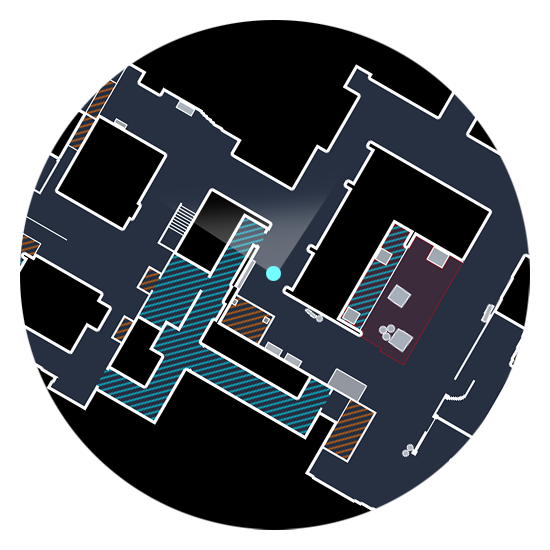
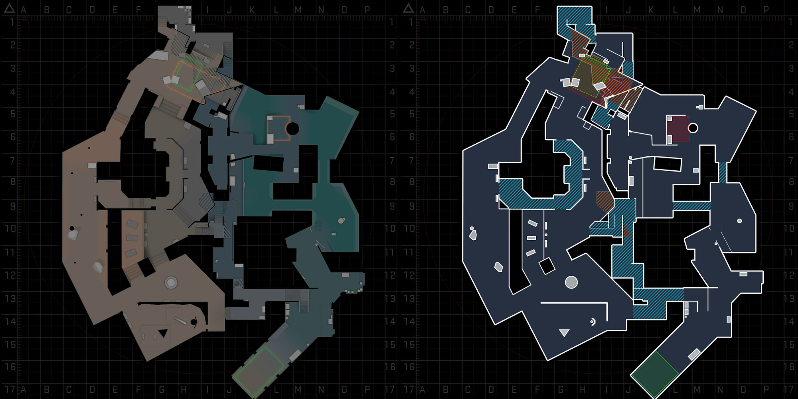

# Autoexec and Resources

This is my personal autoexec file for `csgo` and resources I use to customize the game. Feel free to fork it, download it, do with it as you please.

## Autoexec

The autoexec file has some bindings and game settings organized in a very simple and understable way.

Some of the most noticeable bindings are:
- Everytime you press `tab` to see the game's scoreboard, the `net_graph` will also be shown on the bottom right corner;
- To jumpthrown smokes when you're at the highest possible point of your jump, press `C` while holding a grenade after the pin's already pulled;
- To zoom into the radar's map or zoom out, use the `[` and `]` keys respectively;
- You can select a Smoke Grenade, an HE Grenade, a Flashbang or a Molotov specifically by pressing the keys `v`, `h`, `f` and `t` respectively.

The `autoexec` should autoload automatically everytime you launch the game, but in case it doesn't or you want to run it again after the game's already launched, simply open console and run `exec autoexec`.

## Resources

### Better Radar

I use [Simple Radar](http://simpleradar.com/ "Simple Radar")'s custom radar to replace CSGO's default ones, simply because I prefer their style and precision more. You can go to their website and customize it the way you want it and replace the files inside the `\resources` folder with your version.

Here's an example of an in-game radar using the custom files:

Here's a comparison between the game's default map and the simple radar's version:

---

## Instalation

To copy everything over, simply open command prompt and run `install.cmd`. All the files will be copied over to the game's default location.

If you have installed the game in a different location, you should edit the path inside the `install.cmd` file.